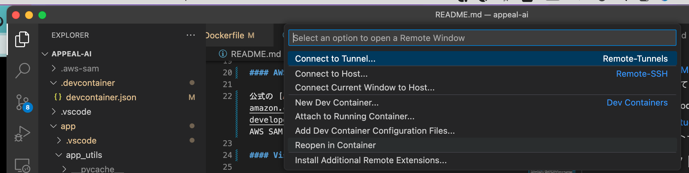
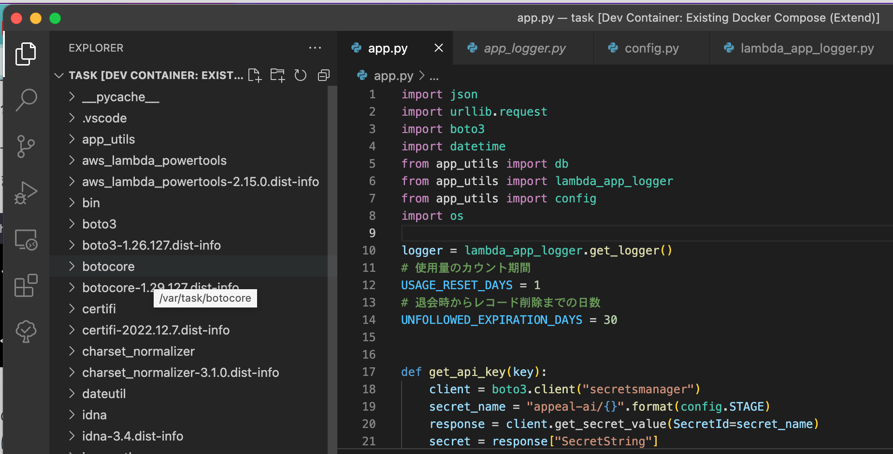

# AWS SAM プロジェクト

このプロジェクトは、AWS Serverless Application Model (SAM) を使用して、AWS Lambda 関数と Amazon API Gateway をデプロイするプロジェクトです。

## プロジェクトのポイント

- lambda から json 形式でログを出力する
- lambda エイリアスをつかった簡単な環境管理（本番、開発）
- Docker をつかって lambda の実行環境をローカルで再現した上で開発作業ができる

## 前提条件

このプロジェクトを使用するには、次のソフトウェアがインストールされている必要があります。

- Docker
- AWS SAM CLI
- Visual Studio Code (VSCode)
  - [Remote Development](https://marketplace.visualstudio.com/items?itemName=ms-vscode-remote.vscode-remote-extensionpack)

### インストール方法

#### Docker

公式の [Docker インストールガイド](https://docs.docker.com/engine/install/) に従って、Docker をインストールしてください。

#### AWS SAM CLI

公式の [AWS SAM CLI インストールガイド](https://docs.aws.amazon.com/serverless-application-model/latest/developerguide/serverless-sam-cli-install.html) に従って、AWS SAM CLI をインストールしてください。

#### Visual Studio Code

公式の [Visual Studio Code インストールガイド](https://code.visualstudio.com/docs/setup/setup-overview) に従って、Visual Studio Code をインストールしてください。

## プロジェクト構成

- template.yaml - aws リソースを定義
- .devcontainer/ - vscode の dev containers 拡張の設定を書く。主に、コンテナ内部で使用する vscode 拡張を定義する。
- \<hoge\>\_app/ - lambda のプロジェクトであり、開発時はこの単位でコンテナを起動する。
  - app_utils/ - lambda のエントリポイントである app.py から参照する各種モジュールを置く
  - app.py - lambda のエントリポイント
  - Dockerfile - lambda のイメージをビルドするためのファイルで、本番用と開発用がある
  - requirements.txt - pip 依存関係を書く
- docker-compose.yaml
  - 起動したいコンテナやその起動の方法を書く

## 使い方

### 環境変数の準備

環境変数を準備する。.env.template の内容をもとに.env を作成し、
docker-compose.yaml から読み込む環境変数を定義する。

### 関数を開発する

#### 既存の関数の開発環境を立ち上げる

まず、設定ファイルを対象の lambda 用に書き換える。
\<hoge\>\_app の単位で lambda プロジェクトとしており、
\<hoge\>\_app の lambda のコードを編集する場合は、
docker-compose.yaml と.devcontainer/devcontainer.json
の該当箇所を\<hoge\>\_app 用に書き換える。

設定ファイルの該当箇所を書き換えたのち、vscode の dev containers 拡張の機能をつかって Reopen In Container をクリックすると、コンテナが起動し、開発環境がセットアップされる。



コンテナ起動と共に、コンテナの作業ディレクトリである/var/task 下で新しく vscode が立ち上がるので、セットアップが終わるまでしばらく待機する。python の vscode 拡張がインストールされて、インテリセンスが有効になっているのが確認できれば ok



#### 新規に関数を作成する

新規で作成するときは、\<hoge\>\_app を参考にディレクトリ作成、docker-compose.yaml、template.yaml 編集を実施する。

### ビルド

プロジェクトのルートディレクトリで以下のコマンドを実行して、プロジェクトをビルドします。

```bash
sam build
```

### デプロイ

初回デプロイの前に、`samconfig.toml` ファイルに必要な情報（例: スタック名、AWS リージョン、S3 バケット名）を記入してください。

プロジェクトをデプロイするには、以下のコマンドを実行します。

```bash
sam deploy --guided
```

`--guided` オプションを使用すると、初回デプロイ時に必要な情報がインタラクティブに聞かれます。それ以降のデプロイでは、`samconfig.toml` に記録された設定が使用されます。

デプロイが完了すると、AWS CloudFormation スタックが作成され、Lambda 関数と API Gateway がデプロイされます。デプロイが成功したら、API Gateway の URL が表示されます。

## その他

詳細な使い方や AWS SAM のドキュメントは、[公式 AWS SAM 開発者ガイド](https://docs.aws.amazon.com/serverless-application-model/latest/developerguide/what-is-sam.html) を参照してください。
